# PO DIFOT Fiori List Report — Step-by-Step Implementation Guide

## Overview

This guide walks you through building a Fiori List Report that scores every purchase order item for **DIFOT** (Delivered In Full, On Time) status directly in SAP S/4HANA Cloud Public Edition.

### Architecture at a Glance

```
I_PurchaseOrderItemAPI01  ──┐
I_PurchaseOrderAPI01       ─┤
I_PurOrdScheduleLineAPI01  ─┼──► ZC_PRPOSchedLineSummary  ──┐
I_PurchaseOrderHistoryAPI01─┼──► ZC_PRPOItemGRSummary     ──┼──► ZC_PRPODIFOT ──► ZC_PRPODIFOT_C ──► OData V4 ──► Fiori App
I_POSupplierConfirmationAPI01┘   ZC_PRPOGRHistoryLines ──────┘     (core calc)   (UI annotations)
```

### File Reference

| File | Location | Description |
|---|---|---|
| `ZC_PRPOItemGRSummary.asddls` | `cds/` | Aggregates net GR quantity per PO item from purchase order history |
| `ZC_PRPOSchedLineSummary.asddls` | `cds/` | Aggregates scheduled quantity and delivery dates from schedule lines |
| `ZC_PRPODIFOT.asddls` | `cds/` | Joins all sources; calculates DIFOT status, flags, variances |
| `ZC_PRPOGRHistoryLines.asddls` | `cds/` | Individual GR lines — navigation target for the Object Page drill-down; must exist before `ZC_PRPODIFOT_C` |
| `ZC_PRPODIFOTStatusVH.asddls` | `cds/` | Fixed-value value help for the DIFOT Status filter field (three values: DIFOT, NOT DIFOT, PENDING) |
| `ZC_PRPODIFOTFailReasonVH.asddls` | `cds/` | Fixed-value value help for the Failure Reason filter field (four values: blank, SHORT, LATE, SHORT AND LATE) |
| `ZC_PRPODIFOT_C.asddls` | `cds/` | Consumption view with Fiori/OData UI annotations |
| `ZC_PRPODIFOT_SRV.asdefs` | `service/` | Service definition — exposes `ZC_PRPODIFOT_C` as an OData V4 service |

### Folder Structure

```
project root/
├── README.md          ← this file
├── cds/                     ← all CDS Data Definition (.asddls) files
│   ├── ZC_PRPOItemGRSummary.asddls
│   ├── ZC_PRPOSchedLineSummary.asddls
│   ├── ZC_PRPODIFOT.asddls
│   ├── ZC_PRPOGRHistoryLines.asddls
│   ├── ZC_PRPODIFOTStatusVH.asddls
│   ├── ZC_PRPODIFOTFailReasonVH.asddls
│   └── ZC_PRPODIFOT_C.asddls
└──  service/                 ← service definition (.asdefs) file
    └── ZC_PRPODIFOT_SRV.asdefs

```

---

## Prerequisites

- ADT (ABAP Developer Tools) installed in Eclipse and connected to your S/4HANA Cloud Public Edition system
- A custom package in your system (e.g. `ZPURCHASING` or similar — if you do not have one, create it in Step 1 below)
- Your user has the developer role (e.g. `SAP_BR_DEVELOPER`)
- The standard CDS views `I_PurchaseOrderItemAPI01`, `I_PurchaseOrderAPI01`, `I_PurOrdScheduleLineAPI01`, `I_PurchaseOrderHistoryAPI01`, and `I_POSupplierConfirmationAPI01` exist in your system (they are delivered with S/4HANA Cloud Public Edition)

---

## Step 1 — Create a Custom Package (if needed)

1. In ADT, open the **ABAP Repository** perspective.
2. Right-click your system node → **New → ABAP Package**.
3. Set:
   - **Name**: `ZPURCHASING` (or your preferred name — use it consistently throughout this guide)
   - **Description**: `Supplier DIFOT development`
   - **Superpackage**: `Your own predefined Superpackage`
4. Assign it to a transport request when prompted, if not a LOCAL development.
5. Click **Finish**.

---

## Step 2 — Create CDS View `ZC_PRPOItemGRSummary`

This view aggregates net goods receipt quantities per PO item.

1. In ADT, right-click your package `ZPURCHASING` → **New → Other ABAP Repository Object**.
2. Under **Core Data Services**, select **Data Definition** → **Next**.
3. Set:
   - **Name**: `ZC_PRPOITEMGRSUMMARY`
   - **Description**: `PO Item GR Quantity Summary`
4. Click **Next**, assign the transport request , if development is not LOCAL→ **Finish**.
5. ADT opens the editor. **Replace the entire content** with the code from `cds/ZC_PRPOItemGRSummary.asddls`.
6. Press **Ctrl+S** to save, then click **Activate** (the icon that looks like a match).
7. Verify it activates without errors in the **Problems** view.

> **Key points about this view:**
> - Filters on `PurchasingHistoryCategory = 'E'` (goods receipts only)
> - Filters on movement types `101` (GR) and `102` (GR reversal)
> - Uses `DebitCreditCode` to net off reversals (`S` = debit/receipt, `H` = credit/reversal)
> - Produces `TotalGRQuantity`, `FirstGRPostingDate`, `LatestGRPostingDate` per PO item

---

## Step 3 — Create CDS View `ZC_PRPOSchedLineSummary`

This view aggregates schedule line data per PO item.

1. Repeat the "New → Data Definition" steps as in Step 2.
2. Set:
   - **Name**: `ZC_PRPOSCHEDLINESUMM`
   - **Description**: `PO Item Schedule Line Summary`
3. Replace the content with the code from `cds/ZC_PRPOSchedLineSummary.asddls`.
4. Save and **Activate**.

> **Key points:**
> - Aggregates `TotalScheduledQuantity`, `EarliestSchedDelivDate`, `LatestSchedDelivDate`
> - For DIFOT date comparison we use `LatestSchedDelivDate` as the deadline — a delivery arriving before or on the latest scheduled line date is considered on time

---

## Step 4 — Create CDS View `ZC_PRPODIFOT`

This is the core DIFOT calculation view. It joins the two aggregation views with PO item and PO header data.

1. Create a new **Data Definition** named `ZC_PRPODIFOT`.
   - **Description**: `PO DIFOT - Delivered In Full and On Time`
2. Replace the content with the code from `cds/ZC_PRPODIFOT.asddls`.
3. Save and **Activate**.

> **DIFOT Logic Summary:**
>
> | Field | Logic |
> |---|---|
> | `QuantityVariance` | `TotalGRQuantity − OrderQuantity` (negative = short) |
> | `DateVarianceInDays` | `LatestGRPostingDate − LatestSchedDelivDate` in days (positive = late) |
> | `IsDeliveredInFull` | `'X'` if `TotalGRQuantity >= OrderQuantity` |
> | `IsDeliveredOnTime` | `'X'` if `LatestGRPostingDate <= LatestSchedDelivDate` |
> | `DIFOTStatus` | `'DIFOT'` / `'NOT DIFOT'` / `'PENDING'` (no GR yet) |
> | `DIFOTFailureReason` | `'SHORT'` / `'LATE'` / `'SHORT AND LATE'` / `''` |

---

## Step 5 — Create CDS View `ZC_PRPOGRHistoryLines`

This view reads individual (non-aggregated) goods receipt and reversal lines from `I_PurchaseOrderHistoryAPI01`. It is used as a navigation target from `ZC_PRPODIFOT_C` so the Fiori Object Page can show a table of individual GR movements when a user drills into a PO item.

1. In ADT, right-click your package `ZPURCHASING` → **New → Other ABAP Repository Object**.
2. Under **Core Data Services**, select **Data Definition** → **Next**.
3. Set:
   - **Name**: `ZC_PRPOGRHISTORYLINES`
   - **Description**: `PO Item GR History Lines`
4. Click **Next**, assign the transport request → **Finish**.
5. **Replace the entire content** with the code from `cds/ZC_PRPOGRHistoryLines.asddls`.
6. Press **Ctrl+S** to save, then **Activate**. 


---

## Step 6 — Create CDS Value Help Views

These two small views provide fixed-value lists for the **DIFOT Status** and **Failure Reason** filter fields in the Smart Filter Bar. Both are custom calculated fields so we give it a value help.

### 6a — Create `ZC_PRPODIFOTStatusVH`

1. In ADT, right-click your package `ZPURCHASING` → **New → Other ABAP Repository Object**.
2. Under **Core Data Services**, select **Data Definition** → **Next**.
3. Set:
   - **Name**: `ZC_PRPODIFOTSTATUSVH`
   - **Description**: `DIFOT Status Value Help`
4. Click **Next**, assign the transport request → **Finish**.
5. **Replace the entire content** with the code from `cds/ZC_PRPODIFOTStatusVH.asddls`.
6. Press **Ctrl+S** to save, then **Activate**. 

### 6b — Create `ZC_PRPODIFOTFailReasonVH`

1. Repeat the "New → Data Definition" steps above.
2. Set:
   - **Name**: `ZC_PRPODIFOTFAILRSNVH`
   - **Description**: `DIFOT Failure Reason Value Help`
3. **Replace the entire content** with the code from `cds/ZC_PRPODIFOTFailReasonVH.asddls`.
4. Save and **Activate**.


---

## Step 7 — Create CDS Consumption View `ZC_PRPODIFOT_C`

This view adds Fiori UI annotations and declares a navigation association to `ZC_PRPOGRHistoryLines` for the Object Page drill-down. OData service exposure is handled in Step 8 via an explicit service definition and binding.

1. Create a new **Data Definition** named `ZC_PRPODIFOT_C`.
   - **Description**: `PO DIFOT List Report`
2. Replace the content with the code from `cds/ZC_PRPODIFOT_C.asddls`.
3. Save and **Activate**.


---

## Step 8 — Create Service Definition and Service Binding (OData V4)

S/4HANA Cloud Public Edition requires an explicit service definition and binding to expose a CDS view as an OData service.

### 8a — Create the Service Definition

1. In ADT, right-click your package → **New → Other ABAP Repository Object**.
2. Under **Business Services**, select **Service Definition** → **Next**.
3. Set:
   - **Name**: `ZC_PRPODIFOT_SRV`
   - **Description**: `PO DIFOT OData Service Definition`
4. Click **Next**, assign the transport request → **Finish**.
5. Replace the content with the code from `service/ZC_PRPODIFOT_SRV.asdefs`.
6. Save and **Activate**.

### 8b — Create the Service Binding (OData V4)

1. Right-click the package again → **New → Other ABAP Repository Object** → **Service Binding** → **Next**.
2. Set:
   - **Name**: `ZC_PRPODIFOT_UI_V4`
   - **Description**: `PO DIFOT OData V4 Service Binding`
   - **Binding Type**: `OData V4 - UI`
   - **Service Definition**: `ZC_PRPODIFOT_SRV`
3. Click **Next**, assign the transport request → **Finish**.
4. Click **Activate**.
5. In the Service Binding editor, click **Publish** Local Service Endpoint.


---
## Step 9 — Create the Fiori App

To create the Fiori app per se, you can either use ADT itself, or you can use SAP BAS (Business Application Studio)

### Step 9a — If you are using ADT
I suggest the following resources:
- [Quickly Generate and Deploy SAP Fiori Apps from ABAP Development Tools for Eclipse](https://community.sap.com/t5/application-development-and-automation-blog-posts/quickly-generate-and-deploy-sap-fiori-apps-from-abap-development-tools-for/ba-p/14116822)
- [Creating SAP Fiori App Using Quick Fiori Application Generator](https://help.sap.com/docs/abap-cloud/abap-development-tools-user-guide/creating-sap-fiori-app-using-quick-fiori-application-generator?locale=en-US)

1. Open the Service Binding `ZC_PRPODIFOT_UI_V4` you create in step 8b
2. In the right pane `Service Version Details`, locate the button `Create a SAP Fiori Application` and click it
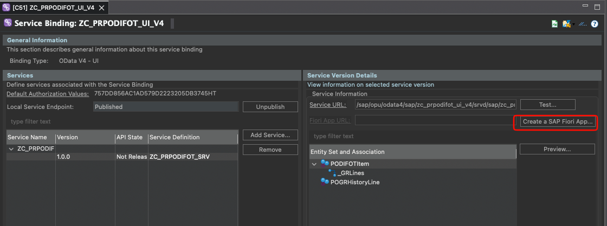
3. Select the option `Create SAP Fiori app with Quick Fiori Application generator in ADT` and click **Create**
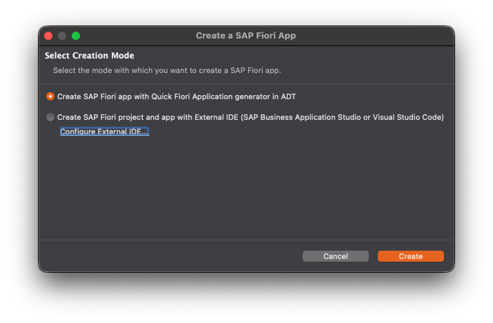
4. Enter the details required to generate the object
   - **Package**: `ZPURCHASING`
   - **Referenced Object**: The service Binding `ZC_PRPODIFOT_UI_V4`
5. Click **Next**
6. Enter the Generator details as in the image below
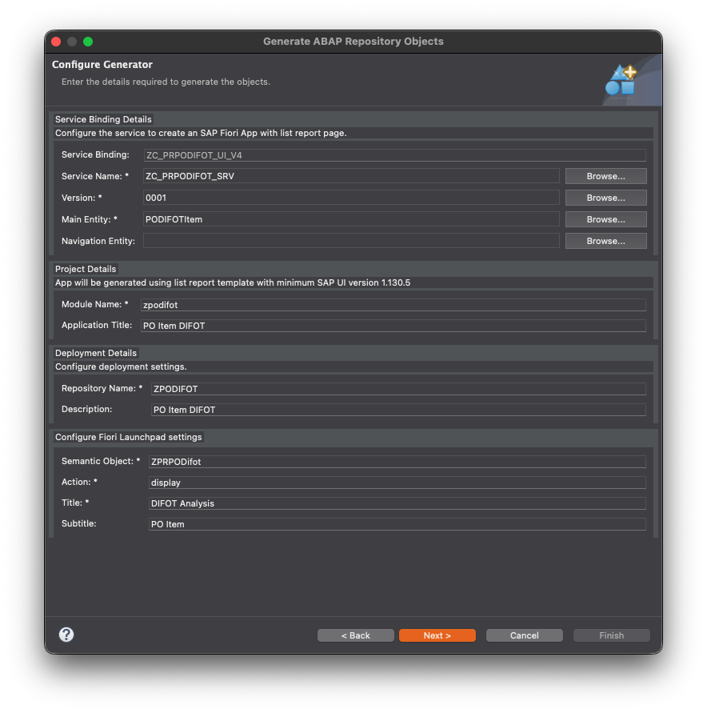
7. View ABAP Artifacts Generation List 
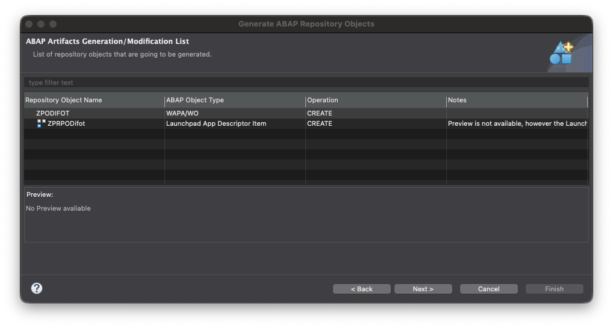
8. Click **Next**, assign the transport request → **Finish**.
9. You should receive a success generation message
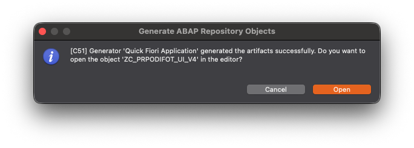
10. This will update the Fiori App URL in the service Binding
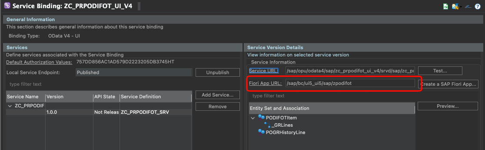


### Step 9b — If you are using BAS (SAP Business Application Studio)
I suggest you follow the Developer learning journey and follow the tutorial [Develop a Custom UI for an SAP S/4HANA Cloud System](https://developers.sap.com/tutorials/abap-custom-ui-bas-develop-s4hc.html). You also have this Developer tutorial that will show you how to create a Destination in BTP to connect to your SAP S/4HANA Cloud system [Connect SAP Business Application Studio and SAP S/4HANA Cloud System](https://developers.sap.com/tutorials/abap-custom-ui-bas-connect-s4hc.html).

This path I will not elaborate on, as the above tutorials are quite explicit.


## Step 10 — Create the IAM App and Business Catalog in ADT

You must create an IAM App (which links the Fiori UI to the OData service) and a Business Catalog (which groups apps for role assignment) in ADT.

### Step 10a — Create the IAM App

1. In ADT, right-click your package `ZPURCHASING` → **New → Other ABAP Repository Object**.
2. Under **Identity and Access Management**, select **IAM App** → **Next**.
3. Set:
   - **Name**: `ZC_PRPODIFOT_TILE`
   - **Description**: `PO Item DIFOT`
   - **Application Type**: `External App`
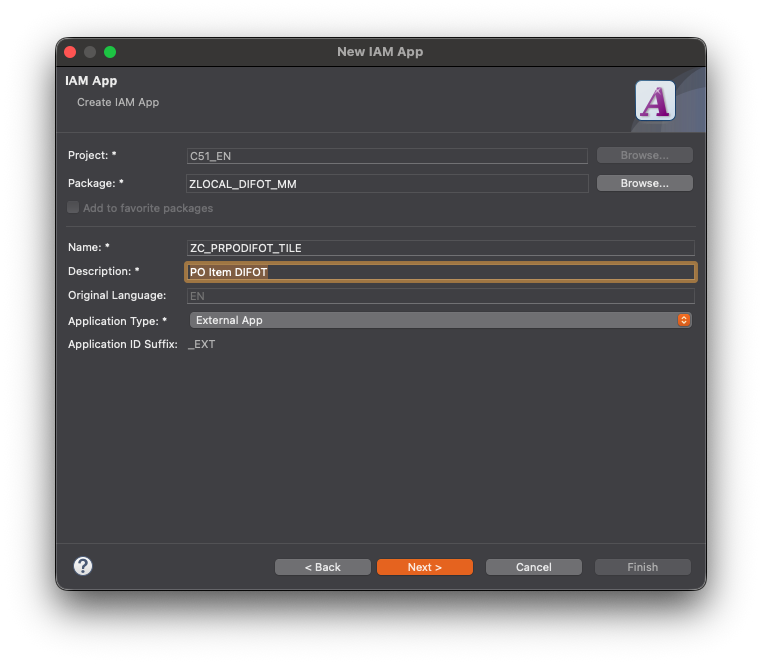
4. Click **Next**, assign the transport request → **Finish**.
5. In the IAM App editor, **Overview** tab:
   - **Fiori Launchpad App Descr Item ID**: `ZPODIFOT_UI5R` enter the UIAD object name created during the deployment — this is `ZPODIFOT_UI5R` (check in ADT under your package → Fiori User Interface → Launchpad App Descriptor Items if unsure)
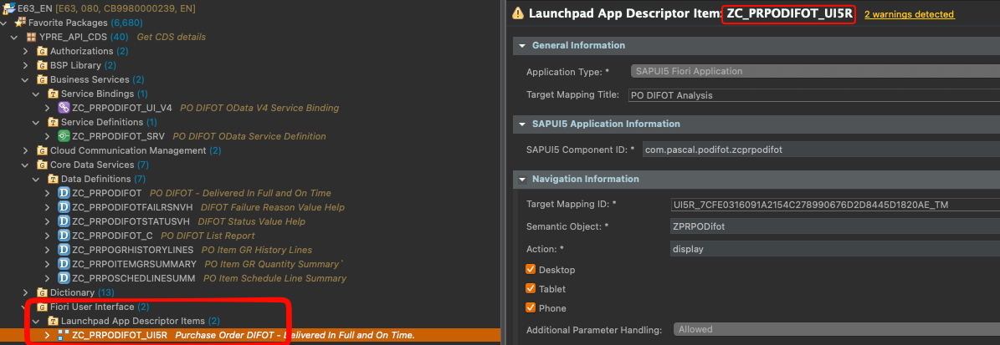
6. Go to the **Services** tab → **Add**:
   - **Service Type**: `OData V4`
   - **Service Name**: `ZC_PRPODIFOT_UI_V4` *(technical name from your service binding editor)*
7. **Save** and .
8. Click **Publish Locally**.

### Step 10b — Create the Business Catalog

1. Right-click your package `ZPURCHASING` → **New → Other ABAP Repository Object**.
2. Under **Cloud Identity and Access Management**, select **Business Catalog** → **Next**.
3. Set:
   - **Name**: `ZC_PRPODIFOT_BC`
   - **Description**: `PO Item DIFOT`
4. Click **Next**, assign the transport request → **Finish**.
5. In the Business Catalog editor, go to the **Apps** tab → **Add** → select `ZC_PRPODIFOT_TILE_EXT`.
4. Click **Next**, assign the transport request → **Finish**.
7. Click **Publish Locally**.
--> You could also here in the 'Restirction Types' tab add authorisation restrictions


### Step 10 — Assign the Catalog to a Business Role (in the Launchpad)

1. Open your Fiori Launchpad and launch the **Maintain Business Roles** app.
2. Create a new role (e.g. name `ZBR_PR_PODIFOT_USER`, description `PO DIFOT Reporting`) or open an existing procurement role you want to add the app to.
3. Go to **Assigned Business Catalogs** → **Add** → search for `ZC_PRPODIFOT_BC` and add it.
4. Under **Access Categories**, ensure at minimum **Read** and **Value Help** are granted.
5. **Save**.

---

### Step 11 — Assign the Role to your User (in the Launchpad)

1. Launch the **Maintain Business Users** app.
2. Find your user → **Assigned Business Roles** → **Add** → select the role from Stage 3.
3. **Save**.
4. Refresh your browser to reload the business role.

---

### Step 12 — Pin the Tile to your Home Page

I would suggest you create a dedidcated Fiori Launchpad Space and Page


1. On the Launchpad home page, click the **pencil (Edit)** icon.
2. Click **App Finder**.
3. Search for `DIFOT` or `PO DIFOT` — the app should appear listed under the IAM App description `PO DIFOT Analysis`.
4. Click the **+** or **pin** icon next to it to add it to your home page.
5. Once pinned you can rename the tile and add a subtitle directly on the home page.


---


### Running the App

All things running smoothly, you should at the end be able to launch the App, which will provide you a list page with a drill down to an object page, specific to a selected purchase order item.

In terms of presentation yo will have a large number of filters at your disposal, with most having a value help to help you search for data, based on data that exists in your system. Some custom value help filters have also been added to help you filter on the custom DIFOT fields introduced in this report.

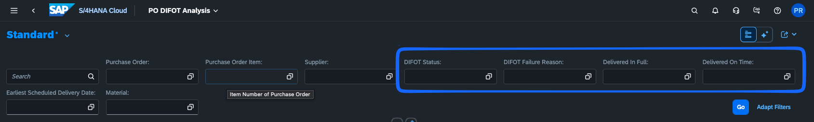

Once you execute the report the main list will be presented with data corresponding to your search criteria, including various DIFOT values and indicators, colour coded.
have also been added to help you filter on the custom DIFOT fields introduced in this report.

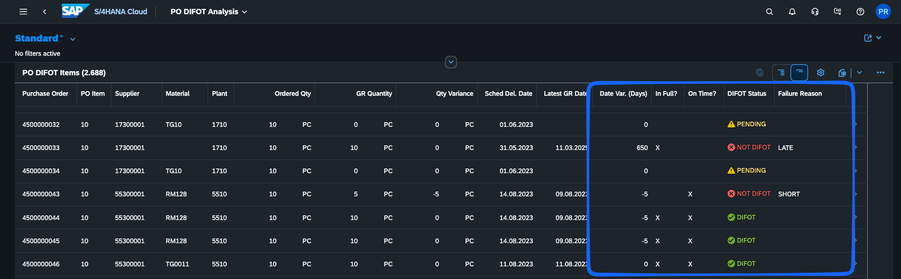

Clciking a specific line, will then drill down to an object page with data specific to the selected purchase order  item line, including the purchase order history, limited to goods movements. This may help you to understand goods receipts and cancellations.

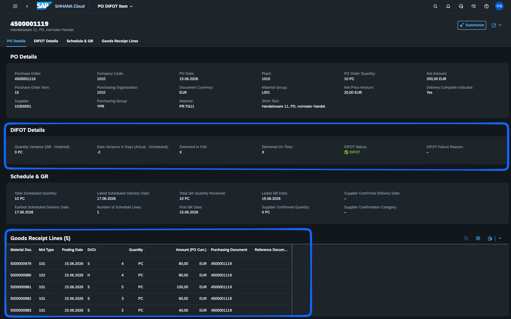
